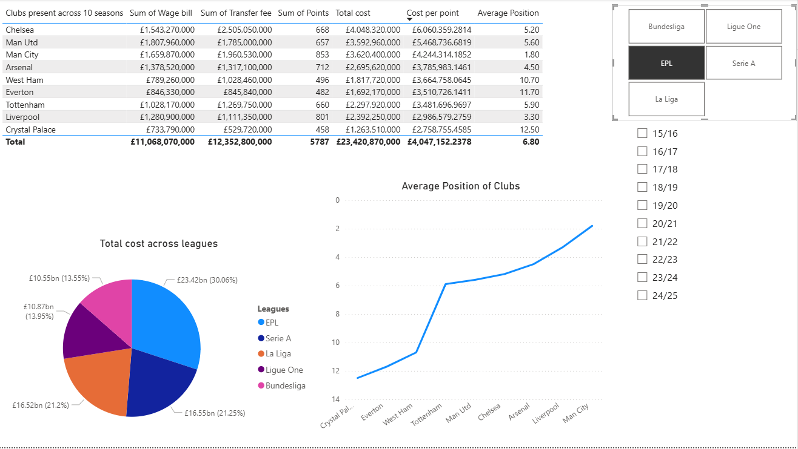

# Data analysis

**Title:** Top 5 league clubs cost of operations Dashboard

**Tools Used:** Excel (power query, xlookup function, unique function, filter function ) and power bi (Measures,slicers, table, pie chart,line chart, power query)

**Project Description:** This project aim is to analyze the cost of success of clubs who remained in the top flight league of the 5 major football leagues in Europe for 10 years spanning from 2015/2016 season till 2024/2025 season. The cost consists of the wage bill and transfer fees spent across those seasons of each club with the aim of finding the cost per point earned. Excel was used to structure and clean data obtained from website sources and Power bi to visualize my findings. Further in depth details can be found in the CCOS steps word document. 

**Key findings:** 

- EPL spends the most across the top 5 leagues with 30% of all spendings occuring between the 9 clubs that have not been relegated
- Serie A has the most number of teams that have remained in the top flight across the 10 years (11 clubs)
- Serie A has the highest number of teams with an average finish of 5th or better (5 clubs)
- La liga is the only league with more than one team with an average position higher than 2nd (Barcelona and Real Madrid) with both of this clubs amongst the top 5 in total cost across the top 5 leagues.
- EPL has the highest nhumber of teams in the top 10 for cost per point (5 clubs)

**Dashboard Overview:** The dashboard includes the following:

- Clubs present across 10 season table: Contains a list of clubs along with thier wage bill, transfer fee, total cost, point tally, cost per point and average position. The list of clubs can be adjusted using the league slicer and the range of values for the rest using the season slicer
- Total cost across leagues pie chart: This chart shows the percent of total cost across the 5 leagues. Interaction with the league slicer has be disabled for functionality but still works with the season slicer if invetigation for total cost across a certain period is required.
- Average postion of clubs line chart: Visual representation of clubs average finish across the league and seasons.
- League slicer : Filter the clubs based on thier respective leagues
- Season slicer : Filters the data based on season

(https://github.com/OduPraie/OduPraie1.github.io/blob/main/Top%205%20league%20clubs%20costs%20of%20operations.pbix)
